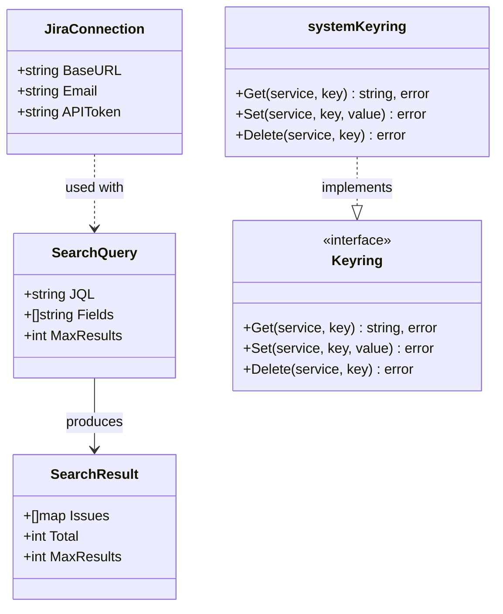
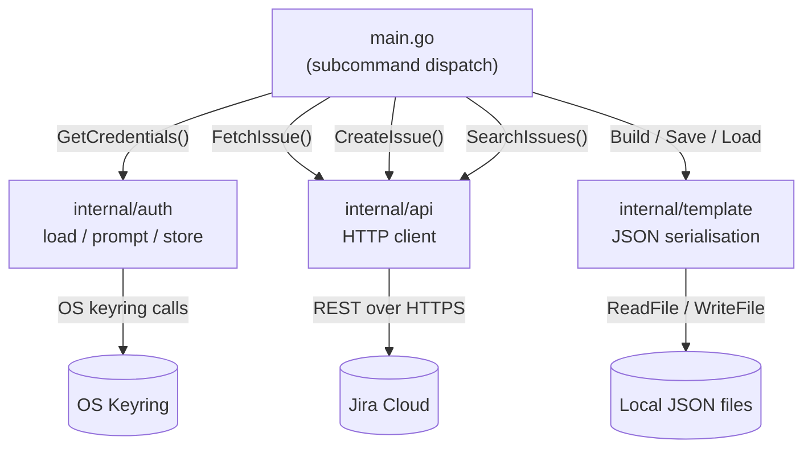

# Architecture

## Overview

`jira-thing` is a CLI tool for templating and creating Jira tickets. It is structured in three internal packages consumed by a single `main` package.

```
CLI (main) ──► internal/api      ──► Jira REST API (HTTPS)
           ──► internal/auth     ──► OS Keyring
           ──► internal/template ──► Local JSON files
```

## Package Responsibilities

| Package | Responsibility |
|---|---|
| `main` | Subcommand routing, user I/O, flag parsing |
| `internal/api` | HTTP requests to the Jira REST API |
| `internal/auth` | Credential load/store via the OS keyring |
| `internal/template` | Build, save, and load JSON ticket templates |

## Class Diagram



## Data Flow



## Commands

| Command | Description |
|---|---|
| `template <KEY> [-o file]` | Fetch a ticket, extract reusable fields, write JSON template |
| `create [-t file]` | Load a template, prompt for summary/description, create ticket |
| `my-tasks [-notupdated]` | List open tickets assigned to `currentUser()`; `-notupdated` filters to tickets idle for 3+ business days |
| `clear-auth` | Delete all stored credentials from the OS keyring |

## Key Design Decisions

- **No database** — templates are standalone JSON files on disk.
- **`Keyring` interface** — allows unit tests to inject an in-memory mock without touching the OS keyring.
- **`executeRequest` helper** — eliminates duplicated HTTP status-check + JSON-decode logic across all three API functions.
- **`SearchQuery` struct** — groups the four search parameters to keep `SearchIssues` within the single-responsibility / argument-count guidelines.
