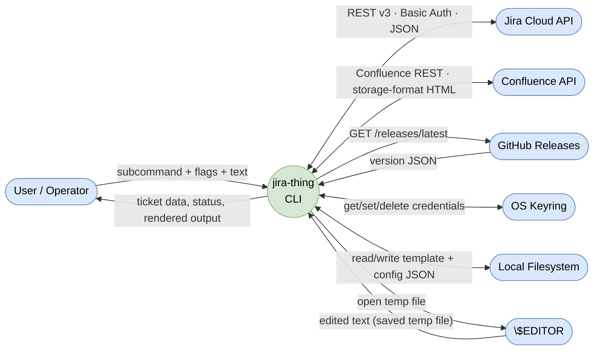
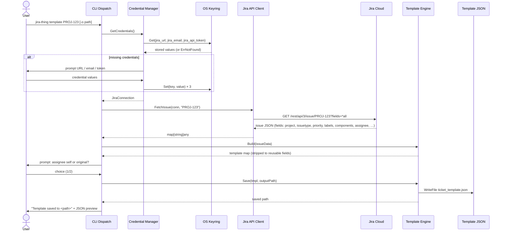
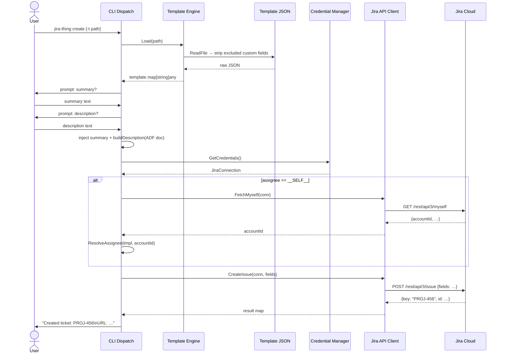
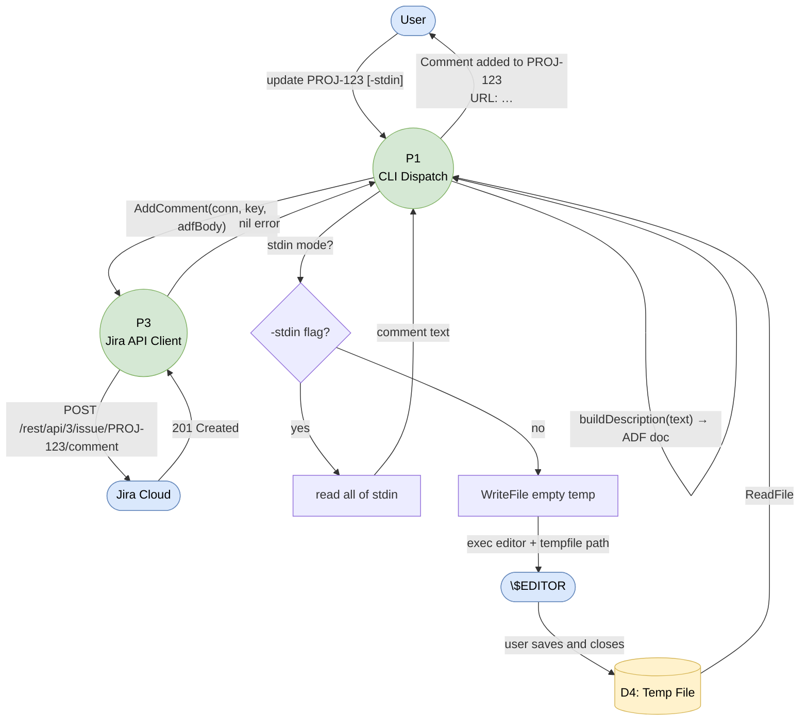
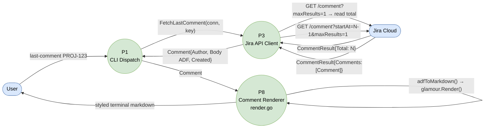
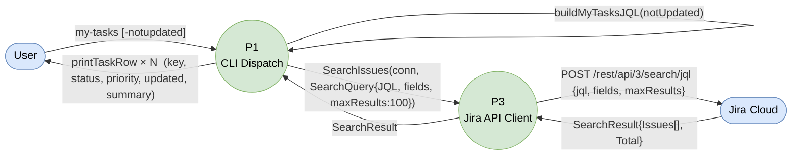
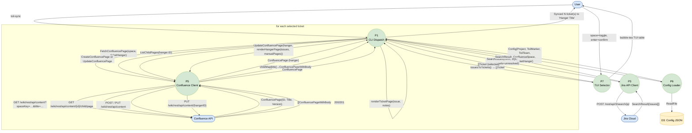
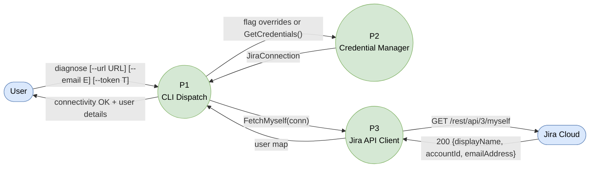
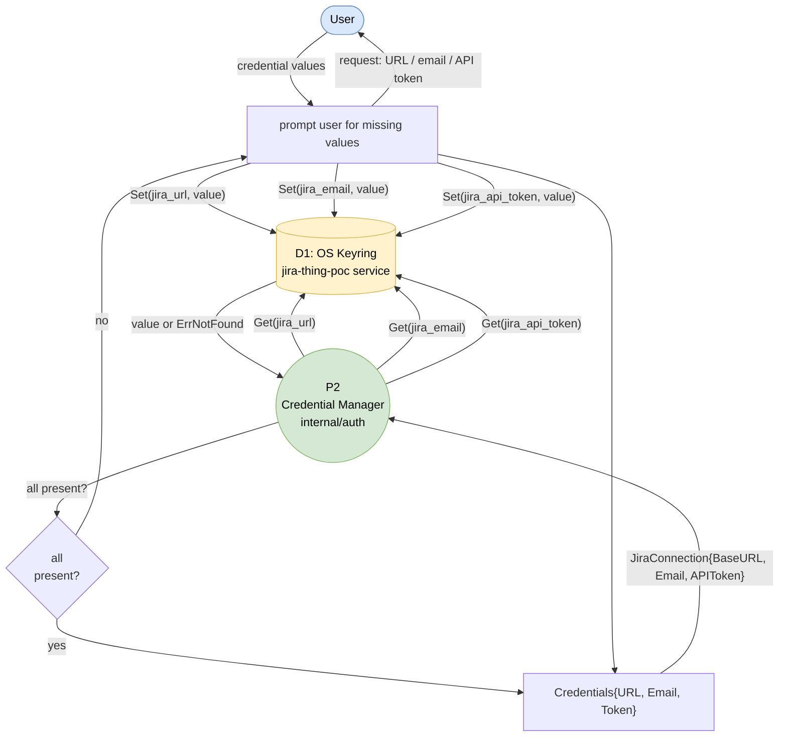

# Data Flow Diagrams

Yourdon–DeMarco notation (adapted for Mermaid):

| Symbol | Mermaid shape | Meaning |
|--------|---------------|---------|
| Rectangle | `[Name]` | External entity |
| Circle | `((P#: Name))` | Process |
| Open rectangle | `[(D#: Name)]` | Data store |
| Arrow + label | `-->|"label"|` | Data flow |

---

## Level 0 — Context Diagram

Shows the entire system as a single process and all external actors.

---

## Level 1 — System Decomposition

Decomposes the system into its seven internal subsystems and four data stores.

```mermaid
flowchart TD
    classDef ext   fill:#dae8fc,stroke:#6c8ebf,color:#000
    classDef proc  fill:#d5e8d4,stroke:#82b366,color:#000
    classDef store fill:#fff2cc,stroke:#d6b656,color:#000

    %% External entities
    U([User]):::ext
    JC([Jira Cloud API]):::ext
    CF([Confluence API]):::ext
    GH([GitHub Releases]):::ext
    ED(["\$EDITOR"]):::ext

    %% Data stores
    D1[(D1: OS Keyring\nURL · email · token)]:::store
    D2[(D2: Template JSON\nticket_template.json)]:::store
    D3[(D3: Config JSON\n~/.config/jira-thing)]:::store
    D4[(D4: Temp Edit File\n/tmp/jira-thing-*.txt)]:::store

    %% Processes
    P1(("P1\nCLI Dispatch\nmain.go")):::proc
    P2(("P2\nCredential\nManager\ninternal/auth")):::proc
    P3(("P3\nJira API\nClient\ninternal/api")):::proc
    P4(("P4\nTemplate\nEngine\ninternal/template")):::proc
    P5(("P5\nConfluence\nClient\ninternal/api\n/confluence")):::proc
    P6(("P6\nConfig\nLoader\ninternal/config")):::proc
    P7(("P7\nTUI Selector\ninternal/tui")):::proc
    P8(("P8\nComment\nRenderer\nrender.go")):::proc

    %% User ↔ CLI
    U       -->|"subcommand + args + text input"| P1
    P1      -->|"status messages + formatted output"| U

    %% P1 ↔ Credential Manager
    P1      -->|"credential request"| P2
    P2     <-->|"Get/Set/Delete keys"| D1
    P2      -->|"prompt: enter URL / email / token"| U
    U       -->|"URL, email, API token"| P2
    P2      -->|"JiraConnection{BaseURL, Email, Token}"| P1

    %% P1 ↔ Config Loader
    P1      -->|"Load()"| P6
    P6     <-->|"ReadFile"| D3
    P6      -->|"Config{Project, ToilMarker, Editor, …}"| P1

    %% P1 ↔ Jira API Client
    P1      -->|"FetchIssue / CreateIssue / SearchIssues\nAddComment / FetchLastComment / FetchMyself"| P3
    P3     <-->|"HTTPS REST v3 · Basic Auth · JSON body"| JC
    P3      -->|"issue map / SearchResult / Comment"| P1

    %% P1 ↔ Template Engine
    P1      -->|"Build(issueData)"| P4
    P1      -->|"Save(tmpl, path)"| P4
    P1      -->|"Load(path)"| P4
    P4     <-->|"ReadFile / WriteFile JSON"| D2
    P4      -->|"template map[string]any"| P1

    %% P1 ↔ Confluence Client
    P1      -->|"FetchConfluencePage / ListChildPages\nCreateConfluencePage / UpdateConfluencePage"| P5
    P5     <-->|"HTTPS REST · Basic Auth · storage-format HTML"| CF
    P5      -->|"ConfluencePage / ConfluencePageWithBody"| P1

    %% P1 ↔ TUI Selector
    P1      -->|"[]Ticket (key, summary, status, priority, updated)"| P7
    P7      -->|"keyboard events display"| U
    U       -->|"row selection + confirm"| P7
    P7      -->|"[]Ticket (selected)"| P1

    %% P1 ↔ Comment Renderer
    P1      -->|"Comment{Body ADF JSON}"| P8
    P8      -->|"styled terminal markdown"| U

    %% P1 ↔ Editor
    P1     <-->|"WriteFile / ReadFile"| D4
    P1      -->|"exec($EDITOR, tempfile)"| ED
    ED      -->|"saved file (via OS)"| D4

    %% Version check
    P1      -->|"GET /repos/…/releases/latest"| GH
    GH      -->|"tag_name, html_url"| P1
```

---

## Level 2 — Command Flows

Each diagram traces data movement for one top-level command.

### 2.1 `template <KEY> [-o file]`

Fetches a ticket and extracts a reusable JSON template.

---

### 2.2 `create [-t template.json]`

Creates a new Jira ticket from a template.

---

### 2.3 `update <KEY> [-stdin]`

Adds a comment to an existing ticket via `$EDITOR` or stdin.

---

### 2.4 `last-comment <KEY>`

Fetches and renders the most recent comment as terminal markdown.

---

### 2.5 `my-tasks [-notupdated]`

Lists open tickets assigned to the current user.

---

### 2.6 `toil-sync`

Queries TOIL tickets, lets user select via TUI, then syncs each to Confluence.

---

### 2.7 `diagnose`

Tests API connectivity and credential resolution end-to-end.

---

### 2.8 Credential Resolution Flow (cross-command)

Shared sub-process invoked by every command that calls `mustConnect()`.

